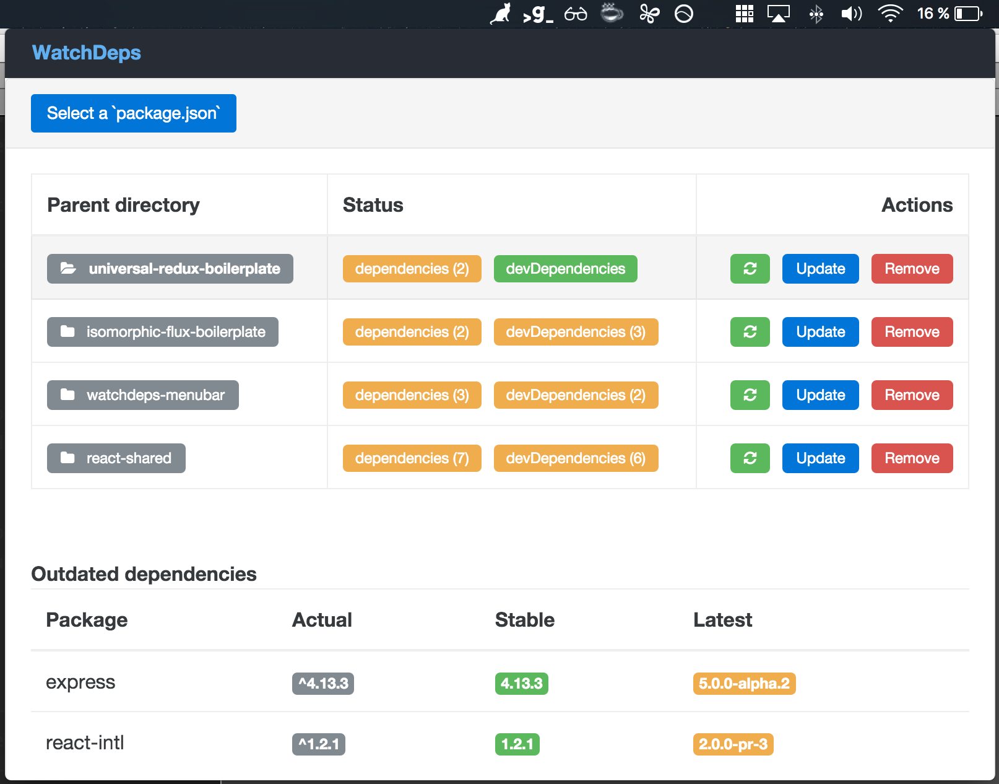

# WatchDeps Menubar

> A wonderful OSX menubar watching your **package.json** applications for updates!

> Application written in [ReactJS](https://facebook.github.io/react/) within the [electron](https://github.com/atom/electron) wrapper [menubar](https://github.com/maxogden/menubar).

### Development

* `$ npm install`
* `$ npm run dev`

It will start webpack-dev-server with hot-reload and the menubar application.

### TODO

* [x] Add react-router
* [x] Add css-loader and postcss-loader (webpack)
* [x] Add redux and redux-devtools
* [x] Add redux-localstorage for persist state
* [x] Add electron devtools
* [ ] Build process
